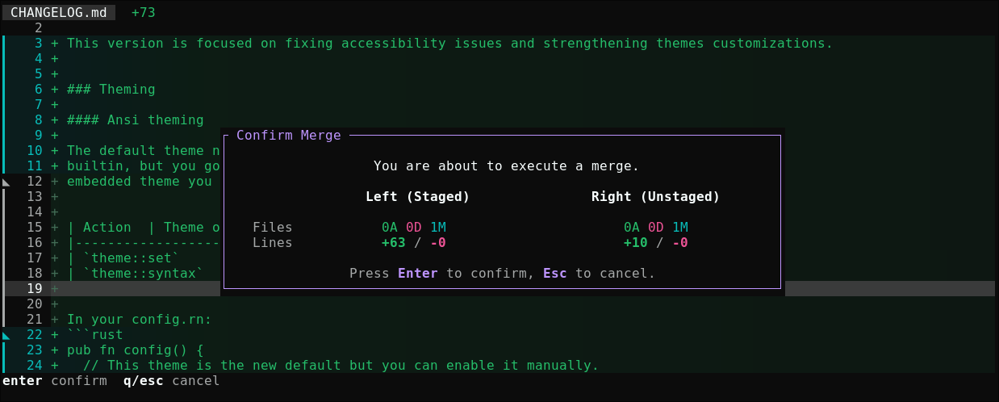
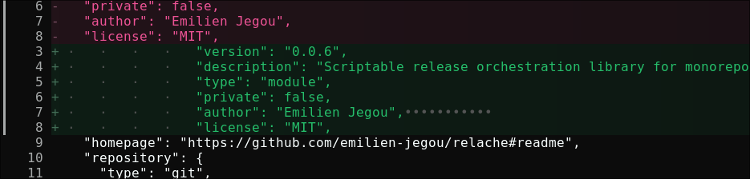

## [0.2.1] - 2026-06-19

Github release x86 target was broken in `0.1.0` & `0.2.0`. This commit fixes the issue.
related Issue: https://github.com/emilien-jegou/oyui/issues/14

added 3 new targets in github releases:
- aarch64-unknown-linux-gnu
- x86_64-apple-darwin
- aarch64-apple-darwin

Built via `joseluisq/rust-linux-darwin-builder` 

### Build
- Add aarch & darwin target to github releases — [`b22d4c1`](https://github.com/emilien-jegou/oyui/commit/b22d4c1e7672b78fe94b9a79af2d45feaed9aeec) by emilien-jegou

---

## [0.2.0] - 2026-06-18

This version is focused on fixing accessibility issues and strengthening themes customizations.

### Breaking changes

- Removed the `theme::get()` action.
- Default theme changed from "weywot" to "ansi"
- +/- icons are no longer dimmed by default in tree view
- Default gradients got changed

To get closer to `0.1.0` appearance add this to your config:
```rust
theme::set("weywot");
theme::file_staged_highlight::set(LineHighlightMode::Gradient(0.08));
theme::file_staged_highlight_opacity::set(0.3);
theme::file_change_highlight::set(LineHighlightMode::Gradient(0.2));
theme::tree_progressive_change_dim::set(true);
```

### Theming

#### Ansi theming

The default theme now follow the terminal colors, it doesn't come with syntax
builtin, but you got a new action to pick only the syntax from the
embedded theme you like.


| Action  | Theme overwrite  | Syntax  overwrite |
|--------------------|--------|--------|
| `theme::set`     | ✅     | ✅     |
| `theme::syntax`    | ❌     | ✅     |


In your config.rn:
```rust
pub fn config() {
  // This theme is the new default but you can enable it manually.
  theme::set("ansi");
  theme::syntax("weywot"); // pick only syntax highlighting from "weywot" theme.
}
```

#### Path prefix

Added support for loading external themes via a `path:` prefix. e.g.:

```rust
theme::set("quaoar"); // classic builtin
theme::set("path:/tmp/aura-dark.tmTheme"); // with custom file

theme::syntax("path:/tmp/aura-dark.tmTheme"); // works with syntax command too!
```

#### Color parsing

Improved color value parsing, including better support for color extraction,
notably from the TextMate theme.

Here is a full demo of all supported color formats:
```rust
theme::bg::set("theme:fg"); // get ref to theme fg
theme::bg::set("red"); // ansi red (term color)
theme::bg::set("ansi:9");
theme::bg::set("ansi256:129");
theme::bg::set("tm:accent"); // from TextMate syntax file
theme::bg::set("rgb(41,41,41)");
theme::bg::set("#f4f4f4");
```

#### new `is_dark` action


`theme::is_dark` main purpose is conditional rendering depending on terminal
color scheme. It works by examining the luminance of the ansi background color.

The following config become possible:

```rust
pub fn config() {
  theme::set("ansi");

  if theme::is_dark() {
    theme::syntax("quaoar");
  } else {
    theme::syntax("dayfox");
  }
```

#### new confirm window

A new confirmation window was added, and can be enable in your config (disabled by default).


To enable it:
```rust
  global::confirm_merge_window_enabled::set(true);
```

#### Display tab and trailing chars

Properly display dot characters for tabs and trailing spaces.

```rust
theme::char_tab_fg::set("red");
theme::char_tab::set("❘");

theme::char_trailing_space_fg::set("red");
theme::char_trailing_space::set("༞");
```

#### New actions to change char scroll character

```rust
theme::char_scroll_fg::set("red");
theme::char_scroll_both::set("↔");
theme::char_scroll_left::set("↤");
theme::char_scroll_right::set("↦");
```




### Feat
- Theme ansi detection and tmTheme loading — [`4d4e2c4`](https://github.com/emilien-jegou/oyui/commit/4d4e2c4f356101cbb4b0757ea3f3f82252af6364) by emilien-jegou
- **oyui-rune-actions:** Simplify handler creation — [`dc39cba`](https://github.com/emilien-jegou/oyui/commit/dc39cbae2c0de65e00a047b7b5487a0d0ec5f2eb) by emilien-jegou
- Improve OSC theme parsing — [`7d5f546`](https://github.com/emilien-jegou/oyui/commit/7d5f546219f9f397f597a84d9389d9bd71c3b724) by emilien-jegou
- New theme actions (theme::syntax & theme::is_dark) — [`e6af5c5`](https://github.com/emilien-jegou/oyui/commit/e6af5c524ff9fba8427d7f57b0e1b7637bc45d9c) by emilien-jegou
- Diff between files — [`2f03d6e`](https://github.com/emilien-jegou/oyui/commit/2f03d6e286b493c7cc8e63bc1801eedf30e10071) by emilien-jegou
- Display trailing whitespace and tabs — [`49c493a`](https://github.com/emilien-jegou/oyui/commit/49c493a34e65dd4963294bfb4a8fdb0df4d82d52) by emilien-jegou
- Reinstate merge confirm window — [`f590ed9`](https://github.com/emilien-jegou/oyui/commit/f590ed918bbd87e395dc24a19e6d88b1b0a46fc5) by emilien-jegou

### Refactor
- Concurrent hashmap and shared event receivers — [`539a9d4`](https://github.com/emilien-jegou/oyui/commit/539a9d401e13e5808ab8d06fe6322db0870f83f1) by emilien-jegou
- Allow empty action handlers — [`935c3cc`](https://github.com/emilien-jegou/oyui/commit/935c3cced5b3e996e2f2ee716bf143913040f215) by emilien-jegou

### Chore
- Add licenses files to crates root — [`357f49f`](https://github.com/emilien-jegou/oyui/commit/357f49f0fa3888a63d9c41ccdee84ed1956df5c2) by emilien-jegou

### Fix
- Unescessary padding on separator — [`0948c9f`](https://github.com/emilien-jegou/oyui/commit/0948c9f532f31f48fa5de20c1aa67f3adb56dbf5) by emilien-jegou
- Regression on line toggling behaviour — [`e0a77bc`](https://github.com/emilien-jegou/oyui/commit/e0a77bc90bbdfb64634538c7172e7aa0e61d9d30) by emilien-jegou
- Broken capitalized keybinds — [`8ffa90e`](https://github.com/emilien-jegou/oyui/commit/8ffa90ec8596d9cc59358876361b4ee90333df73) by emilien-jegou
- Allow empty merge — [`4c4334f`](https://github.com/emilien-jegou/oyui/commit/4c4334f2def68f58d7bf3008a0b81a49c5bae2e6) by emilien-jegou

---

## [0.1.0] - 2026-06-08

### Refactor
- Fix clippy issues — [`26c903d`](https://github.com/emilien-jegou/oyui/commit/26c903da845f096be92e2302e4ee45b14cccdf5b) by emilien-jegou

### Feat
- Add missing keybinds hints — [`2d3b3df`](https://github.com/emilien-jegou/oyui/commit/2d3b3df5dc0e1de767b3a1026636d3acaeb2a703) by emilien-jegou
- Improve line toggling — [`8f4f302`](https://github.com/emilien-jegou/oyui/commit/8f4f30278322dd724e41eb813f0d35a5d20fd46b) by emilien-jegou
- Add per-line staging toggle with `t` key — [`3e2cf1e`](https://github.com/emilien-jegou/oyui/commit/3e2cf1e950ab0aa9d1975de322204b475bb77ba4) by Gaëtan Lehmann
- Add page up/down key bindings for file and tree views — [`1bde194`](https://github.com/emilien-jegou/oyui/commit/1bde19465499bc93f03f99504d9f145a7b1ace0d) by Gaëtan Lehmann

---

## [0.0.7] - 2026-06-02

### Bug Fixes

- Broken command mode — [`eb09ae4`](https://github.com/emilien-jegou/oyui/commit/eb09ae412ef6437c6ba0535ae47ce6947ac1bf60) by Emilien, 2026-06-02


---

## [0.0.3] - 2026-06-02

### Bug Fixes

- Removed some dead options — [`87a67cc`](https://github.com/emilien-jegou/oyui/commit/87a67cc83e76fbc7f4c6417b8206627477f925e1) by Emilien, 2026-05-20
- Wrong files picked in merge + empty dir skipped — [`ff6ab25`](https://github.com/emilien-jegou/oyui/commit/ff6ab25dee59cc2676864100b7f572e94ad1e11a) by Emilien, 2026-05-22
- Deleted/added file were not being displayed in file view — [`bd49e56`](https://github.com/emilien-jegou/oyui/commit/bd49e56c9332f723e7e095be7dc7724c75cef378) by Emilien, 2026-05-22
- Outdated keybinds helper — [`29e0dd2`](https://github.com/emilien-jegou/oyui/commit/29e0dd2fac67ce2681f7c881ffa763ad689d897c) by Emilien, 2026-05-26
- Duplicate fold keybind — [`b64adcc`](https://github.com/emilien-jegou/oyui/commit/b64adcc4d2bbde9c0ea27577ef013d74c01caa5a) by Emilien, 2026-05-26
- Regression on hunk staging — [`48d896f`](https://github.com/emilien-jegou/oyui/commit/48d896fcc6f4370894383c721ff720b5ab354960) by Emilien, 2026-06-02
- Tree invert action ignored partial hunk staging — [`b3be203`](https://github.com/emilien-jegou/oyui/commit/b3be203bc5a0ecd140605f2c93e9dedc4bcc0d95) by Emilien, 2026-06-02
- Broken 'G' keybind on tree and file view — [`52f5b10`](https://github.com/emilien-jegou/oyui/commit/52f5b10e885c5ef37b3f0c0f8a55696c174e67f7) by Emilien, 2026-06-02

### Documentation

- Description of goals in readme — [`ac3cf30`](https://github.com/emilien-jegou/oyui/commit/ac3cf30bf5f106d2245f76607161750019727cb8) by Emilien, 2026-05-20
- Just inproved feature copy in readme — [`769444b`](https://github.com/emilien-jegou/oyui/commit/769444b677e2bf5f728f26721ab75b276f204583) by Emilien, 2026-05-20
- Updated readme — [`d2eb90e`](https://github.com/emilien-jegou/oyui/commit/d2eb90e543b637f3dfb85685ddad4158c6343778) by Emilien, 2026-05-24
- Wider screenshots for theme.md — [`6fae970`](https://github.com/emilien-jegou/oyui/commit/6fae970e6ac498c53f8a251c9d3ba30018eb3bd5) by Emilien, 2026-05-26
- Re-arrange feature list — [`ce688f7`](https://github.com/emilien-jegou/oyui/commit/ce688f7a81e6451c44c744253306f4669e655a74) by Emilien, 2026-05-26
- Update LSP information in readme — [`1149b84`](https://github.com/emilien-jegou/oyui/commit/1149b845baec5e2e65a4e98da216d30fe88908fe) by Emilien, 2026-06-01
- Update feature & bug tracking — [`b28fd2e`](https://github.com/emilien-jegou/oyui/commit/b28fd2e7bc9ffc8b44dfd2358e870d08d89f9e45) by Emilien, 2026-06-02
- Gif in readme — [`568da8c`](https://github.com/emilien-jegou/oyui/commit/568da8cb7b7a2aea0715fb16a57e09d51c265b94) by Emilien, 2026-06-02
- Add a language badge in readme — [`580d67a`](https://github.com/emilien-jegou/oyui/commit/580d67ab120d8c499f164e7e2c1b8c47647698b4) by Emilien, 2026-06-02

### Feat

- Bootstrap — [`d6b2517`](https://github.com/emilien-jegou/oyui/commit/d6b2517500710a3df0d1ab8426dba189a9fb0ecd) by Emilien, 2026-05-19
- Add shortcut for tree inversion — [`770ffd0`](https://github.com/emilien-jegou/oyui/commit/770ffd032a5d921d2fb0f59b7fee354a8174cd97) by Emilien, 2026-05-19
- Shortcuts, file view changes and app refactoring — [`3e84ce7`](https://github.com/emilien-jegou/oyui/commit/3e84ce75582bf12b7e375ed45a69905036b4d17b) by Emilien, 2026-05-20
- Dynamic +/- colors based on modification weight — [`7a88dbb`](https://github.com/emilien-jegou/oyui/commit/7a88dbb04716ab9358770ee5ba62f4aa2b54dc22) by Emilien, 2026-05-20
- Improve initial stats performance via rayon + tracing — [`db64278`](https://github.com/emilien-jegou/oyui/commit/db642785a50e7c9ecddb2c8e1b6134210a0a5a88) by Emilien, 2026-05-21
- Better handling of binary files — [`0a7b0a3`](https://github.com/emilien-jegou/oyui/commit/0a7b0a39f7ad1ceb66709fc4b31c960b70620ea4) by Emilien, 2026-05-23
- Experimental syntax aware diffing — [`5e374a2`](https://github.com/emilien-jegou/oyui/commit/5e374a2d62f8191d5cca6915c0f0d8551d8c75c9) by Emilien, 2026-05-24
- Add scrolloff option — [`b433902`](https://github.com/emilien-jegou/oyui/commit/b433902d801af2f2aa691418a7fafc1c1210fb0e) by Emilien, 2026-05-24
- Collapse long directory chains. — [`f1db4ed`](https://github.com/emilien-jegou/oyui/commit/f1db4ed2ca806691a2c71367483dc61718a019cd) by Emilien, 2026-05-24
- 'n' and 'N' shortcuts for hunk navigation — [`24f34ea`](https://github.com/emilien-jegou/oyui/commit/24f34ea1c0464ebc54da8b993c61061a175c5411) by Emilien, 2026-05-24
- Hunk staging — [`a5d8824`](https://github.com/emilien-jegou/oyui/commit/a5d88249fe0ca79ecf1722ce0669ee185665a3d1) by Emilien, 2026-05-24
- Config.toml and theming (+30 themes) — [`75f7212`](https://github.com/emilien-jegou/oyui/commit/75f72126cd169da969f7b208374e2e49f80c1158) by Emilien, 2026-05-25
- Add --config option in cli — [`2a7aa4a`](https://github.com/emilien-jegou/oyui/commit/2a7aa4ac7436887c677877d2a40d8f3962d978d9) by Emilien, 2026-05-26
- Automate themes.md creation — [`0f4dc71`](https://github.com/emilien-jegou/oyui/commit/0f4dc71fae2147a0909c2b5f6314576f599958c8) by Emilien, 2026-05-26
- Dynamic fallback based on theme light/dark mode — [`85eabf1`](https://github.com/emilien-jegou/oyui/commit/85eabf15d1bd47346cbc12d4563654fa80c777d5) by Emilien, 2026-05-26
- Highlight configuration for theming — [`4ee536b`](https://github.com/emilien-jegou/oyui/commit/4ee536b24ad05bc4dba5a2bc68519df9656e49d8) by Emilien, 2026-05-26
- Horizontal scroll in file view — [`1fcdff9`](https://github.com/emilien-jegou/oyui/commit/1fcdff920a72008d49fee6a908254f05bc74cc13) by Emilien, 2026-05-26
- Rune config and keybinds — [`c9baa8b`](https://github.com/emilien-jegou/oyui/commit/c9baa8b6ace7651d73c7d2acb7b0bc3a8c4fe8f4) by Emilien, 2026-05-28
- Sub-splitting hunks with keybinds — [`944d9ff`](https://github.com/emilien-jegou/oyui/commit/944d9ff57a9258a3f2ca417ebc1d5ecb81b94582) by Emilien, 2026-06-02
- Invert action for file view — [`42a54cd`](https://github.com/emilien-jegou/oyui/commit/42a54cd96e9bb0b59f63504206f06cd32eb025f7) by Emilien, 2026-06-02
- Add devicon integration — [`1ce9dc5`](https://github.com/emilien-jegou/oyui/commit/1ce9dc55cca44305b62dbd0b2937e52c164da3cd) by Emilien, 2026-06-02
- Cargo packaging — [`90c7d66`](https://github.com/emilien-jegou/oyui/commit/90c7d663c3787f338716e52c724682f5843cda7d) by Emilien, 2026-06-02

### Refactoring

- Simplify async task creation logic — [`36e27a5`](https://github.com/emilien-jegou/oyui/commit/36e27a512b8e76c8a1de003bdaac2b7e68b1e3bf) by Emilien, 2026-05-21
- Divide file view in logical parts — [`b0f301e`](https://github.com/emilien-jegou/oyui/commit/b0f301eb7147218fd488dcd1b676c8d88655d66a) by Emilien, 2026-05-27
- Remove manual define of action handler — [`d6cb855`](https://github.com/emilien-jegou/oyui/commit/d6cb855db9f47f5ee3028d20d22380cd2001c49a) by Emilien, 2026-06-02
