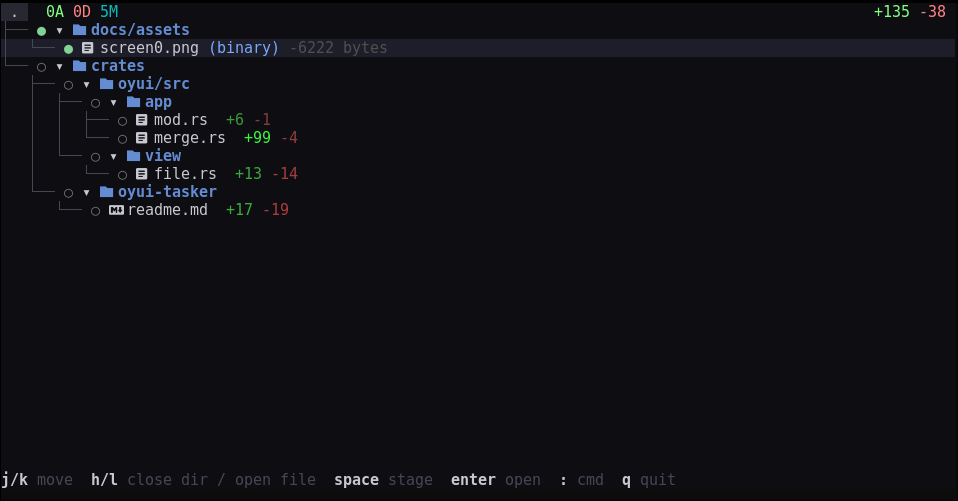
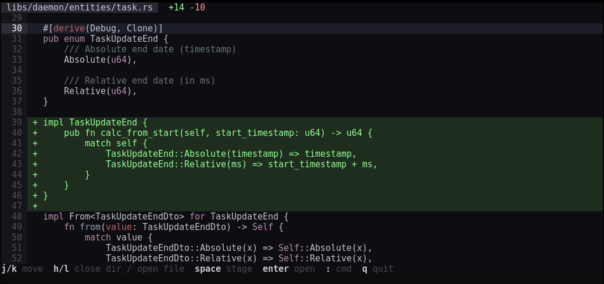

# Oyui

**Oyui** is a TUI merge tool and staging interface designed for [Jujutsu](https://github.com/martinvonz/jj) and Git.



## Why Another merge editor?

While Jujutsu is a powerful VCS, I found the built-in diff-editing experience (via `scm-record`) to be limited. It lacked syntax highlighting, was mostly monochromatic, and made it difficult to visualize the impact of changes across full files. Although some more polished solution like `lightjj` exist (web based), we were missing a modern TUI merge editor.

I built **Oyui** to bridge this gap, focusing on a friction-free experience with:
*   **Intuitive:** One view, natural navigation, simple UX.
*   **Visual Clarity:** Balanced, and color-coded tree-view that is easy on the eyes.
*   **Keyboard-First:** Simple keybinds, hjkl (following vim tradition) or arrow key.
*   **Efficient Workflow:** Perform bulk actions (like staging by folder) instantly via the command palette. see feature section.

## Features

*   **Command Palette:** Perform bulk operations with simple commands.
    *   `:add ./icons/*` (or `:a`) to stage files.
    *   `:unstage ./icons/*` (or `:u`) to unstage files.
*   **Themed Diffs:** Beautiful, readable syntax highlighting for your changes.
    

---

## Roadmap & Feedback
Follow the progress of new features on the [Feature Tracking page](./docs/feature-tracking.md). Have an idea? [Open an issue](https://github.com/emilien-jegou/oyui/issues/new)!

### Known Limitations
*   In-file hunk splitting
*   Conflict resolution views
*   Three-way split view

---

## Installation (Nix Flakes)

Add `oyui` to your `flake.nix` inputs:

```nix
inputs.oyui = {
  url = "github:emilien-jegou/oyui";
  inputs.nixpkgs.follows = "nixpkgs"; 
};
```

Then, add it to your system packages:

```nix
environment.systemPackages = [
  inputs.oyui.packages.${pkgs.system}.default
];
```

---

## Configuration

### Jujutsu (`config.toml`)
Configure Jujutsu to use Oyui as your primary diff editor:

```toml
[ui]
diff-editor = "oyui"
diff-instructions = false

[merge-tools.oyui]
program = "oyui"
edit-args = ["-d", "$left", "$right"]
```

---

## Credits

*   [scm-record](https://github.com/arxanas/scm-record)
*   [oyo](https://github.com/ahkohd/oyo)
