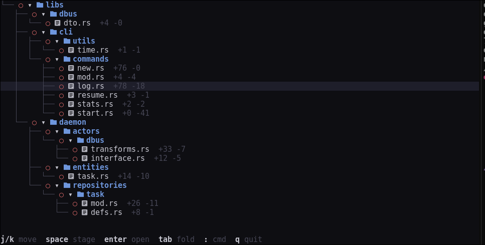
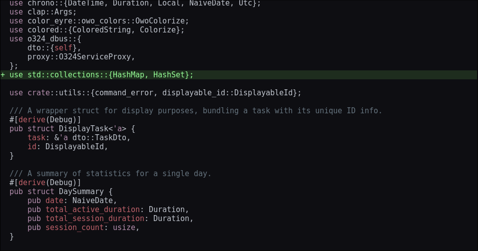

# Oyui

A merge tool editor for jujutsu and git.




## Features

- A command palette to glob stage/unstage files e.g.
```
:add ./icons/* # or :a
:unstage ./icons/* # or :u
```
- Themed diff

- Notably missing: in-file hunk split (**WIP**)


## Installation via flakes

```nix
inputs.oyui = {
  url = "github:emilien-jegou/oyui";
  inputs.nixpkgs.follows = "nixpkgs"; # optional
};

# ...

environment.systemPackages = with pkgs; [
  inputs.oyui.packages.${pkgs.system}.default
]
```

## Configuration for jujutsu

```config.toml
[ui]
diff-editor = "oyui"
diff-instructions = false

[merge-tools.oyui]
program = "oyui"
edit-args = ["-d", "$left", "$right"]
```

## Credits

[scm-record](https://github.com/arxanas/scm-record)
[oyo](https://github.com/ahkohd/oyo)
