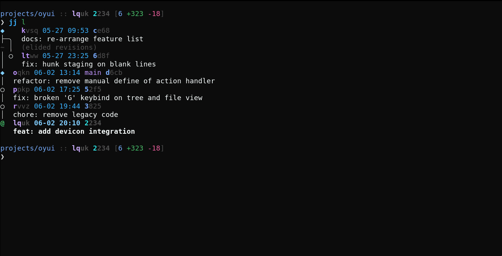
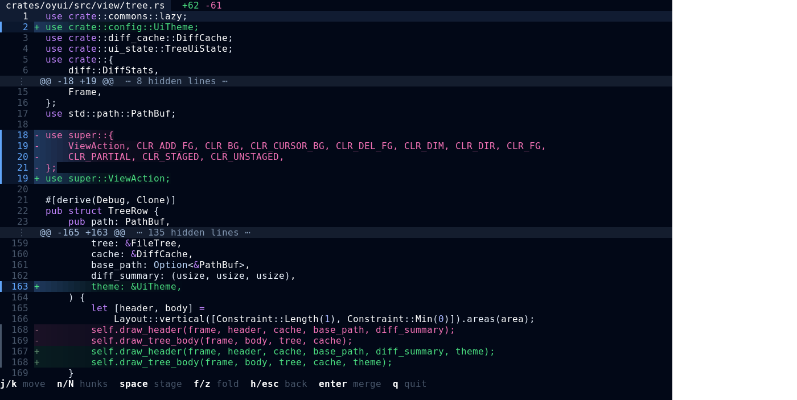

# Oyui


[](https://crates.io/crates/oyui)


[](https://github.com/emilien-jegou/oyui)
[](https://deps.rs/crate/oyui/latest)

**Oyui** is a modern TUI merge tool and staging interface for [Jujutsu](https://github.com/martinvonz/jj) and Git.



## Features

*   🔧 **Scriptable config with hot reload:** Your config is a script much like how vim use lua or emacs use lisp, oyui use rune! modify it and see changes live.
*   🖥️ **Command Palette:** Perform bulk operations with simple commands.
    *   `:add **/*md` -- to stage all markdown files in diff.
    *   `:unstage **/*md` -- to unstage them.
*   🔢 **Binary support:** Infer binary files format using their [magic number signature](https://en.wikipedia.org/wiki/Magic_number_(programming)).
*   🧠 **Config LSP:** Oyui come with a complex type-safe LSP builtin, set it up and avoid configuration error.
*   🎨 **Theming:** 40+ builtin themes, check [full list](./docs/themes.md).




## Why Another merge editor?

While Jujutsu is a powerful VCS, the built-in diff-editing experience (via `scm-record`) is quite limited. It lack syntax highlighting, is mostly monochromatic, and made it difficult to visualize the impact of changes across full files. Although some more polished solution like `lightjj` exist (web based), we were missing a modern TUI merge editor.

## 📦 Installation

### Cargo

```sh
cargo install oyui
```

### Nix Flakes

Add `oyui` to your `flake.nix` inputs:

```nix
inputs.oyui = {
  url = "github:emilien-jegou/oyui";
  inputs.nixpkgs.follows = "nixpkgs"; 
};
```

Then, add it to your system packages:

```nix
environment.systemPackages = [
  inputs.oyui.packages.${pkgs.system}.default
];
```

## ⚙️ Configuration

Setup the default config for oyui at `~/.config/oyui/config.rn`:

```rust
// Rune language documentation at: https://rune-rs.github.io/
// this is your entrypoint...
pub fn config() {
  // Oyui comes with 40+ built-in themes out of the box:
  // aura, ayu, catppuccin-mocha, dracula, gruvbox-dark, nord,
  // one-dark, everforest-light...
  //
  // Full list at:
  // https://github.com/emilien-jegou/oyui/tree/main/docs/themes.md
  theme::set("weywot");

  // Overwritting theme specific config.

  // 50+ actions and settings to configure, check the documentation:
  // https://github.com/emilien-jegou/oyui/wiki/Actions-API
  theme::bg::set("#000000");
  theme::file_staged_highlight::set(LineHighlightMode::Gradient(0.05));

  // You can nest config per view with on_mode:
  on_mode("file", || {
    // keybind can take modifiers: "ctrl", "shift" or "alt"
    keybind("ctrl-j", || view::file::cursor::down(5));
    keybind("ctrl-k", || view::file::cursor::up(5));
  });

  on_mode("tree", || {
    keybind("ctrl-j", || view::tree::cursor::down(5));
    keybind("ctrl-k", || view::tree::cursor::up(5));
  });
}
```

### Usage with Jujutsu (`config.toml`)

To use oyui as your primary merge editor with Jujutsu add the following section in `~/.config/jj/config.toml`:

```toml
[ui]
diff-editor = "oyui"
diff-instructions = false

[merge-tools.oyui]
program = "oyui"
edit-args = ["diff", "$left", "$right"]
```

### Enabling config LSP with neovim

If you are using the builtin neovim LSP, you can add the following to your lua config:

```lua
  vim.lsp.config('oyui_ls', {
    cmd = { "oyui", "language-server" },
    filetypes = { "rune" },
    root_markers = { "config.rn" },
    capabilities = capabilities,
  })

  -- Add it to your existing list of lsp clients
  vim.lsp.enable({ ..., 'oyui_ls' })
```

You can verify it is correctly loaded by using the command `:checkhealth lsp`
while on the config file.

## 🗺️ Roadmap & Feedback

Follow the progress of new features on the [Feature Tracking page](https://github.com/emilien-jegou/oyui/wiki/Feature-tracking). Have an idea? [Open an issue](https://github.com/emilien-jegou/oyui/issues/new)!


## 🙏 Credits

*   [scm-record](https://github.com/arxanas/scm-record)
*   [oyo](https://github.com/ahkohd/oyo)
*   [syndiff](https://docs.rs/syndiff/latest/syndiff/)
