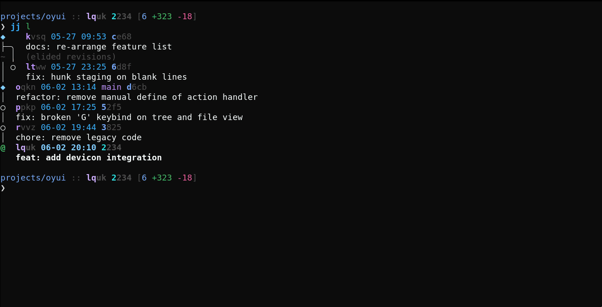
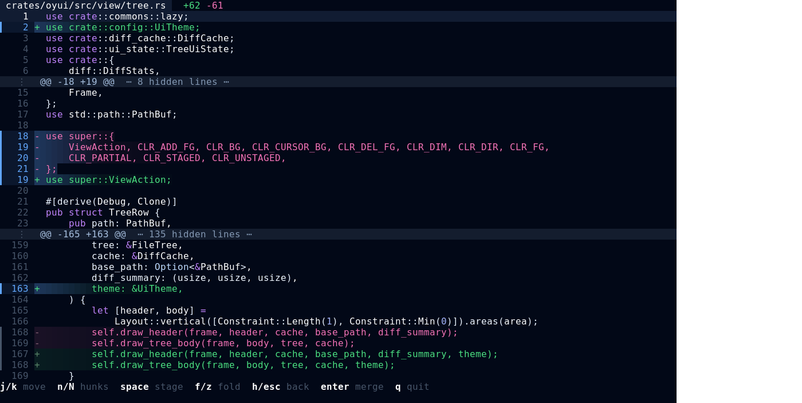

# Oyui


[](https://crates.io/crates/oyui)


[](https://github.com/emilien-jegou/oyui)
[](https://deps.rs/crate/oyui/latest)

**Oyui** is a modern TUI merge tool and staging interface for [Jujutsu](https://github.com/martinvonz/jj) and Git.



## Features

*   🔧 **Scriptable config with hot reload:** Your config is a script much like how vim use lua or emacs use lisp, oyui use rune! modify it and see changes live.
*   🖥️ **Command Palette:** Perform bulk operations with simple commands.
    *   `:add **/*md` -- to stage all markdown files in diff.
    *   `:unstage **/*md` -- to unstage them.
*   🔢 **Binary support:** Infer binary files format using their [magic number signature](https://en.wikipedia.org/wiki/Magic_number_(programming)).
*   🧠 **Config LSP:** Oyui come with a complex type-safe LSP builtin, set it up and avoid configuration error.
*   🎨 **Theming:** 40+ builtin themes, check [full list](./docs/themes.md).



### Command support

- Full support: `jj commit -i`, `jj squash -i`, `jj split`, `jj diffedit`, `jj restore -i`, `jj resolve`, `jj diff --tool`, `jj interdiff --tool`, `git difftool`, `git mergetool`

## Why Another merge editor?

While Jujutsu is a powerful VCS, the built-in diff-editing experience (via `scm-record`) is quite limited. It lack syntax highlighting, is mostly monochromatic, and made it difficult to visualize the impact of changes across full files. Although some more polished solution like `lightjj` exist (web based), we were missing a modern TUI merge editor.

## 📦 Installation

### Cargo

```sh
cargo install oyui
```

### Nix Flakes

Add `oyui` to your `flake.nix` inputs:

```nix
inputs.oyui = {
  url = "github:emilien-jegou/oyui";
  inputs.nixpkgs.follows = "nixpkgs"; 
};
```

Then, add it to your system packages:

```nix
environment.systemPackages = [
  inputs.oyui.packages.${pkgs.system}.default
];
```

## 📚 Documentation

- [Configuration & scripting](./docs/configuration.md)
- [Script API reference](./docs/actions.md)
- [Default keybindings](./docs/keybindings.md)
- [Builtin themes](./docs/themes.md)

## ⚙️ Configuration

Setup the default config for oyui at `~/.config/oyui/config.rn`:

```rust
// Rune language documentation at: https://rune-rs.github.io/
// this is your entrypoint...
pub fn config() {
  // Oyui comes with 40+ built-in themes out of the box:
  // aura, ayu, catppuccin-mocha, dracula, gruvbox-dark, nord,
  // one-dark, everforest-light...
  //
  // Full list at:
  // https://github.com/emilien-jegou/oyui/tree/main/docs/themes.md
  theme::set("weywot");

  // Overwritting theme specific config.

  // 100+ actions and settings to configure, see docs/actions.md:
  // https://github.com/emilien-jegou/oyui/blob/main/docs/actions.md
  theme::bg::set("#000000");
  theme::file_staged_highlight::set(LineHighlightMode::Gradient(0.05));

  // You can nest config per view with on_mode:
  on_mode("file", || {
    // keybind can take modifiers: "ctrl", "shift" or "alt"
    keybind("ctrl-j", || view::file::cursor::down(5));
    keybind("ctrl-k", || view::file::cursor::up(5));
  });

  on_mode("tree", || {
    keybind("ctrl-j", || view::tree::cursor::down(5));
    keybind("ctrl-k", || view::tree::cursor::up(5));
  });
}
```

### Usage with Jujutsu (`config.toml`)

To use oyui as your primary merge editor with Jujutsu add the following section in `~/.config/jj/config.toml`:

```toml
[ui]
diff-editor = "oyui"
diff-instructions = false

[merge-tools.oyui]
program = "oyui"
# Two-way diff editor: jj commit -i, squash -i, split, diffedit, restore -i.
edit-args = ["jj", "edittool", "$left", "$right"]
# Read-only viewer: jj diff --tool oyui, jj interdiff --tool oyui.
diff-args = ["jj", "difftool", "$left", "$right"]
# Three-way merge editor: jj resolve. jj allows confirming with conflicts left.
merge-args = ["jj", "mergetool", "$base", "$left", "$right", "-o", "$output"]
```

`oyui jj edittool` edits the two-way diff (`$left` vs `$right`, writing back to
`$right`); `oyui jj mergetool` resolves a three-way conflict (`$base`, `$left`,
`$right`) and writes the result to `$output`.

`oyui jj mergetool` shows conflicts **inline in the file view**, with the marker
blocks highlighted among the normal hunks. Conflicts are read from markers
already in the target (git's `$MERGED`, jj's materialized file); when the
target is clean, oyui synthesizes a three-way merge from `$base`/`$left`/`$right`
instead — using jj snapshot-style markers for `jj mergetool` and git markers
for `git mergetool`, so no conversion ever happens. With the
cursor on a conflict side, `space` folds it with that side; `space` on the
frame expands it back, `enter` writes the resolved file. Conflict hunks are
not stageable. `jj resolve` stores conflicts structurally, so `oyui jj
mergetool` permits confirming with conflicts left. `oyui git mergetool` follows
git and refuses. Quitting with `q` cancels the merge without touching the
output (non-zero exit, so the VCS discards it).

### Usage with Git

As a difftool (read-only viewer):

```sh
git config --global difftool.oyui.cmd 'oyui git difftool "$LOCAL" "$REMOTE"'
git config --global difftool.prompt false
git difftool --tool=oyui
```

As a mergetool:

```sh
git config --global mergetool.oyui.cmd 'oyui git mergetool "$BASE" "$LOCAL" "$REMOTE" -o "$MERGED"'
git config --global mergetool.prompt false
git mergetool --tool=oyui
```

> Quitting with `q` instead of confirming exits 0 without writing, so git
> cannot tell an abort from a success via the exit code — do **not** set
> `mergetool.oyui.trustExitCode`. Always check the file after a session you
> did not explicitly confirm with `enter`.

Git passes `/dev/null` for added or deleted files; oyui treats that as a
missing side automatically.

### Standalone and VCS-agnostic commands

Run oyui with no arguments inside a repository to open the current change. It
detects whether the directory is a Jujutsu or Git working copy:

```sh
oyui                      # jj: `jj diffedit` on @; git: working-tree diff
oyui diff                 # diff the current change
oyui diff -r @-           # Jujutsu-style revision selection
oyui diff --from main --to @
oyui interdiff --from @- --to @
oyui split                # split the current change into two commits
oyui split -m "part one"  # message for the selected (first) commit
oyui resolve              # resolve the current change's conflicts
oyui squash               # squash the selected hunks into the parent
oyui squash -k            # ... and keep the emptied source change (jj)
```

`oyui diff` and `oyui interdiff` accept the same revision selection as
`jj diff` / `jj interdiff` (`-r/--revisions`, `-f/--from`, `-t/--to`, and
trailing paths). When neither revision is given, `oyui interdiff` compares the
current change with its parent.

- **Jujutsu** delegates to `jj interdiff --tool oyui`.
- **Git** reproduces jj's interdiff by rebasing the `--from` patch onto `--to`'s
  parent with `git merge-tree` (conflict-free, since one side is the merge base)
  and diffing the result against `--to`.

`oyui split` opens the change with nothing selected; pick the hunks for the
**first** commit with `space`, then press `enter`. The unselected changes stay
in the second commit.

- **Jujutsu** delegates to `jj split` with oyui as the interactive diff editor,
  so jj owns snapshotting, descriptions and rebasing. Use `-r` to split another
  revision.
- **Git** is implemented by oyui: it compares HEAD with the working tree and
  creates two commits (the selected hunks, then the rest). The previous HEAD is
  kept at `refs/oyui/split-backup` and in the branch reflog, so
  `git reset --hard <old>` undoes it. Only regular files are supported
  (submodules, symlinks and `--` path restrictions are refused), and the
  working tree is left clean.

`oyui resolve` opens every conflict of the current change in the merge editor:

- **Jujutsu** delegates to `jj resolve --tool oyui`; conflicts may be confirmed
  as-is (jj stores them structurally).
- **Git** delegates to `git mergetool --tool=oyui` over the unmerged files;
  every conflict must be resolved before confirming.

`oyui squash` folds changes into the parent. It starts with everything
selected (jj errors with "No changes selected" otherwise), so `enter` squashes
all of the change; unstage the hunks to keep.

- **Jujutsu** delegates to `jj squash --tool oyui` (`-f/--from`, `-t/--into`,
  `-k/--keep-emptied` are forwarded).
- **Git** is implemented by oyui: it amends HEAD with the selected working-tree
  hunks (preserving the parent, merge parents and author) and leaves the
  unselected changes in the working tree. The previous HEAD is again at
  `refs/oyui/split-backup` for `git reset --hard`.

### Enabling config LSP with neovim

If you are using the builtin neovim LSP, you can add the following to your lua config:

```lua
  vim.lsp.config('oyui_ls', {
    cmd = { "oyui", "language-server" },
    filetypes = { "rune" },
    root_markers = { "config.rn" },
    capabilities = capabilities,
  })

  -- Add it to your existing list of lsp clients
  vim.lsp.enable({ ..., 'oyui_ls' })
```

You can verify it is correctly loaded by using the command `:checkhealth lsp`
while on the config file.

## 🗺️ Roadmap & Feedback

Follow the progress of new features on the [Feature Tracking page](https://github.com/emilien-jegou/oyui/wiki/Feature-tracking). Have an idea? [Open an issue](https://github.com/emilien-jegou/oyui/issues/new)!


## 🙏 Credits

*   [scm-record](https://github.com/arxanas/scm-record)
*   [oyo](https://github.com/ahkohd/oyo)
*   [syndiff](https://docs.rs/syndiff/latest/syndiff/)
